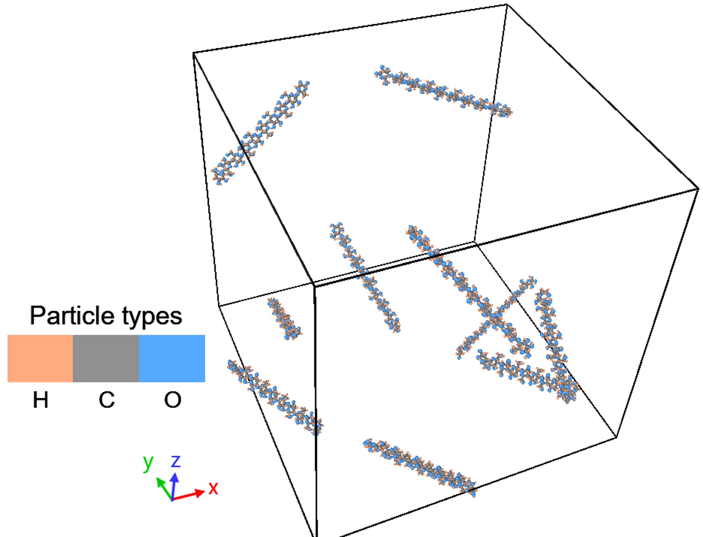
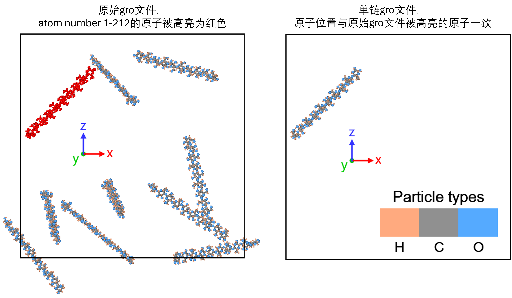
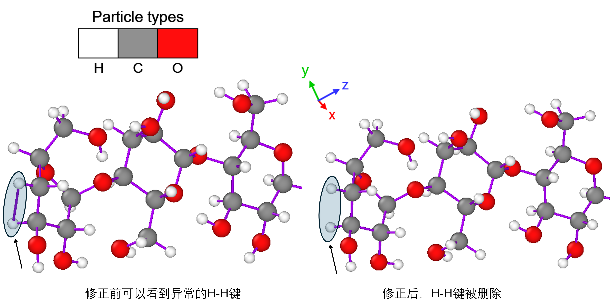
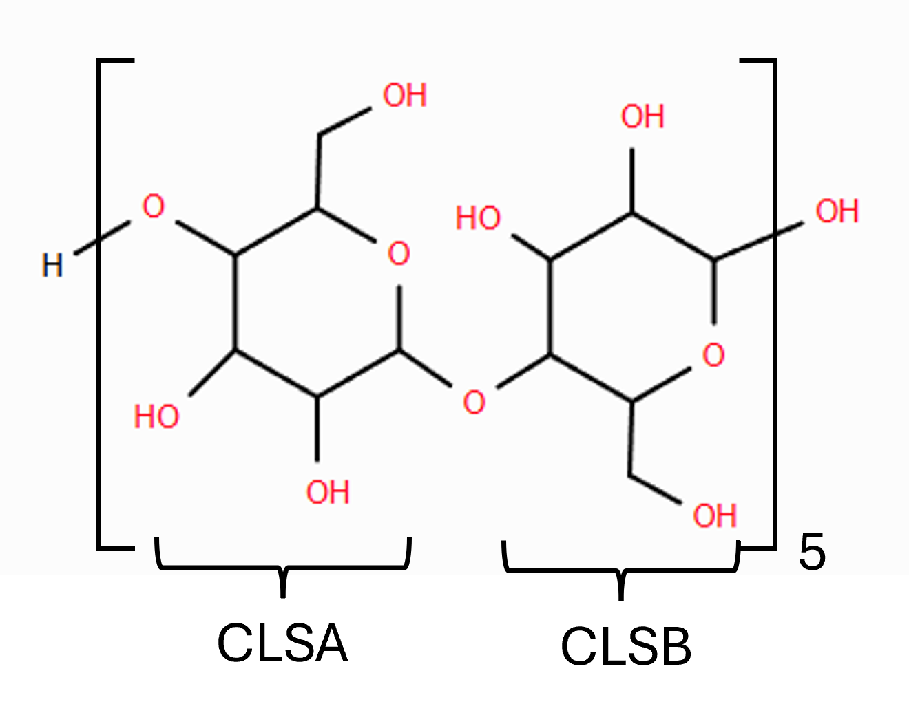

# 1. 体系拆分

## 1.1 原始 `gro` 的理解

原始`gro`为给定坐标文件 `polymer/CLS_10chains.gro`。该文件每行信息如下：

- 第1行是标题行

- 第2行给出的总原子数为2120

- 第3行至第2122行（倒数第二行）是原子行。根据GROMACS[官方说明](https://manual.gromacs.org/archive/5.0.3/online/gro.html#:~:text=Files%20with%20the%20gro%20file%20extension%20contain%20a,be%20used%20as%20trajectory%20by%20simply%20concatenating%20files.)，依次为
	- residue number (5 positions, integer)
	- residue name (5 characters)
	- atom name (5 characters)
	-  (5 positions, integer)
	- position (in nm, x y z in 3 columns, each 8 positions with 3 decimal places)
	
	例如对于` 100CLSB  H102 2120  6.902  2.435  3.942`这行，残基编号是`100`，残基名称是`CLSB`，原子名称是`H102`，原子编号是`2120`，空间坐标是`(6.902 nm, 2.435 nm, 3.942 nm)`。
	
- 第2123行（最后一行）是模拟盒子的尺寸，单位是nm。在这里，盒子尺寸是12 nm x 12 nm x 12 nm。

观察residue列可知：体系包含 residue 1-100。也就是有100个残基，要么是CLSA，要么是CLSB。体系有三种原子：C、H、O。

观察atom name列可知，从第3行开始，每212行为一个循环。例如，在第215行之前，氢原子从`H1`逐渐变化到`H102`，但在第215行又变回了`H1`。脚本`scripts/check_atom_name_cycles.py`的输出为

```
Atom-name cycle check: PASS
Input file: F:\polymer_task\polymer\CLS_10chains.gro
Total atoms: 2120
Atoms per cycle: 212
Cycle count: 10
Atom-name sequence is identical in every 212-atom cycle.
Atom names are unique within each 212-atom cycle.
First atom name in each cycle: H1
Last atom name in each cycle: H102
```

由此可以证实：`polymer/CLS_10chains.gro`的 atom name序列每212个原子就会有一次完全重复，且每个212原子块内部的atom name唯一。

结合可视化软件，可进一步证实这一点：



由此推断，该体系由10条相同聚合物链组成。每条链包含 10 个 residue、212 个原子，总计为：

```text
10 chains x 10 residues/chain = 100 residues
10 chains x 212 atoms/chain   = 2120 atoms
```

链与原子编号的对应关系如下：

```text
chain 1: residue 1-10,   atom 1-212
chain 2: residue 11-20,  atom 213-424
chain 3: residue 21-30,  atom 425-636
...
chain 10: residue 91-100, atom 1909-2120
```

本报告选择第一条链，即residue 1-10、atom 1-212。选择第一条链的原因是其原子编号已经从1开始，生成单链坐标时不需要额外重编号，后续也更容易与单链拓扑对应。

## 1.2 单链拆分过程

拆分过程使用 Python 脚本 `scripts/extract_first_chain_gro.py` 完成。脚本中的通用 `.gro` 读写函数放在 `scripts/utils/gmx_io.py` 中，包括：

- `read_gro()`：读取标题行、原子数、原子坐标行和盒子尺寸行；
- `write_gro()`：根据标题、原子坐标行和盒子尺寸行写出新的 `.gro` 文件；
- `parse_gro_atom_line()`：按照 `.gro` 固定列宽格式解析 residue 编号、residue 名、原子名和原子编号。

具体处理逻辑为：

1. 读取 `polymer/CLS_10chains.gro`；
2. 检查原始文件原子数不少于 212；
3. 取原始坐标文件中前 212 条原子坐标行，即 atom 1-212；
4. 保留原始盒子尺寸行；
5. 将标题行改为单链说明，并将原子数写为 212；
6. 输出单链坐标文件 `single_chain/CLS_single.gro`。

生成的单链坐标文件为：

```text
single_chain/CLS_single.gro
```

该文件包含 212 个原子，对应原始体系中的第一条聚合物链。

## 1.3 结果检查方式

为了确认拆出的单链结果是自洽的，本工作同时采用脚本检查和可视化检查。

脚本检查由 `scripts/extract_first_chain.py` 在写出 `CLS_single.gro` 后自动执行，检查内容包括：

- `CLS_single.gro` 第 2 行原子数为 212；
- 实际原子坐标行数为 212；
- 单链原子编号从 1 连续到 212；
- residue 范围为 1-10；
- 原始文件中的下一条链从 residue 11、atom 213 开始；
- 拆出的 212 条原子坐标与原始 `CLS_10chains.gro` 中 atom 1-212 完全一致；
- 单链文件保留了原始 `gro` 文件的盒子尺寸行。

脚本输出如下：

```text
Single-chain .gro self-consistency check: PASS
Original atoms: 2120
Single-chain atoms: 212
Single-chain atom range: 1-212
Single-chain residue range: 1-10
Next chain starts at residue 11 CLSA, atom 213 H1
Atom coordinates match original atoms 1-212 exactly.
Box line is preserved from the original .gro file.
```

此外，还进行了可视化检查。在原始 `CLS_10chains.gro` 中将 atom 1-212 高亮显示，可以看到这些原子在空间上构成一条完整且连续的聚合物链，而不是分散在多条链中。随后将提取出的 `CLS_single.gro` 单独可视化，其构象与原始体系中的高亮链一致。



因此，结合编号检查、坐标逐行一致性检查和可视化结果，可以确认 `single_chain/CLS_single.gro` 是从原始多链体系中正确拆出的第一条聚合物单链坐标文件。
# 2. 拓扑修正与组织

## 2.1 单链 ITP 的生成

原始拓扑文件为 `topology/CLS_10chains.itp`，对应 10 条聚合物链，`[ moleculetype ]` 名称为 `CLS10`，并包含 2120 个原子及完整 10 链体系的 bonded interactions。任务一得到的 `single_chain/CLS_single.gro` 只包含第一条链的 212 个原子，因此不能直接使用原始 10 链拓扑。

单链拓扑由脚本 `scripts/task2/extract_first_chain_itp.py` 生成。处理逻辑如下：

1. 使用 ParmEd 读取 `topology/CLS_10chains.itp`；
2. 截取前 212 个原子，对应第一条链；
3. 保留只属于这 212 个原子的 bonds、pairs、angles 和 dihedrals；
4. 将输出的 moleculetype 命名为 `CLS`；
5. 写出单链拓扑 `single_chain/CLS_single_raw.itp`；
6. 检查单链itp文件与单链gro文件的一致性。

为了确认 `topology/CLS_10chains.itp` 的前 212 个 `[ atoms ]` 条目确实与 `single_chain/CLS_single.gro` 中的 212 个原子对应，脚本在写出单链 ITP 后进行了逐项检查。检查复用 `scripts/utils/gmx_io.py` 中的 ParmEd 读入接口，分别读取 `single_chain/CLS_single.gro` 和 `topology/CLS_10chains.itp`，并比较前 212 个原子的顺序编号、residue 顺序编号、residue name 和 atom name。

检查输出为：

```text
GRO/ITP atom correspondence check: PASS
Checked atoms: 212
First atom: 1 1 CLSA H1
Last atom: 212 10 CLSB H102
```

这说明 `single_chain/CLS_single.gro` 中的 atom 1-212 与 `topology/CLS_10chains.itp` 中 `[ atoms ]` 前 212 项在编号、残基和原子名称上完全一致，因此可以用原始 ITP 的前 212 个原子作为单链拓扑的来源。

生成的单链拓扑中，`[ moleculetype ]` 为：

```text
[ moleculetype ]
; Name            nrexcl
CLS             3
```

这要求主拓扑中的 `[ molecules ]` 段也使用同名分子 `CLS`。

## 2.2 主拓扑文件组织

为了测试单链拓扑能否被 GROMACS 正确读取，先编写最小主拓扑文件 `single_chain/topol_raw.top`，包含刚生成的 `CLS_single_raw.itp`：

```text
[ defaults ]
# 这里省略了，直接从topology/CLS_10chains.itp拷贝即可
[ atomtypes ]
# 这里省略了，直接从topology/CLS_10chains.itp拷贝即可

#include "CLS_single_raw.itp"

[ system ]
CLS single chain

[ molecules ]
CLS 1
```

其中 `[ defaults ]` 和 `[ atomtypes ]` 可以从原始 `topology/CLS_10chains.itp` 中注释段落直接拷贝。

`[ system ]` 和 `[ molecules ]` 较简单，可以手写。其中 `[ molecules ]` 写作`CLS 1`，表示当前坐标文件中有 1 个 `CLS` 分子。这与 `single_chain/CLS_single.gro` 中只包含一条聚合物链相对应，也与单链 ITP 中的 moleculetype 名称一致。

## 2.3 grompp 验证

使用单链拓扑尝试生成 `.tpr`，测试单链坐标、单链拓扑和主拓扑是否能被 GROMACS 读取：

```bash
gmx_mpi grompp \
  -f mdp/em.mdp \
  -c single_chain/CLS_single.gro \
  -p single_chain/topol_raw.top \
  -o single_chain/em_raw.tpr
```

在GROMACS 2022.2环境下，弹出警告

```
WARNING 1 [file mdp/em.mdp, line 33]:
  Unknown left-hand 'controller' in parameter file
```

回看`em.mdp`，确实有一个字段`controller = horizon`。弹出这个警告，说明GROMACS无法识别这个字段。注释掉这个字段，再次运行，该命令成功生成 `.tpr`。关键输出包括：

```text
Generated 28 of the 28 non-bonded parameter combinations
Generating 1-4 interactions: fudge = 0.5

Generated 28 of the 28 1-4 parameter combinations

Excluding 3 bonded neighbours molecule type 'CLS'

turning H bonds into constraints...
Analysing residue names:
There are:    10      Other residues
Analysing residues not classified as Protein/DNA/RNA/Water and splitting into groups...
Number of degrees of freedom in T-Coupling group rest is 530.00

The largest distance between excluded atoms is 0.399 nm
Calculating fourier grid dimensions for X Y Z
Using a fourier grid of 100x100x100, spacing 0.120 0.120 0.120

Estimate for the relative computational load of the PME mesh part: 1.00

NOTE 1 [file mdp/em.mdp]:
  The optimal PME mesh load for parallel simulations is below 0.5
  and for highly parallel simulations between 0.25 and 0.33,
  for higher performance, increase the cut-off and the PME grid spacing.
```

这说明 `atomtypes`、`defaults`、moleculetype 名称、原子数以及 bonded interactions 在 GROMACS 预处理层面可以被正确读取。输出中的 PME mesh load 是性能提示，不是拓扑错误。

## 2.4 可视化与价态检查

虽然 `grompp` 可以生成 `.tpr`，但这只能说明拓扑在 GROMACS 语法和参数层面可被解释，并不保证化学键连接完全合理。因此进一步将单链体系导出为带键连信息的 PDB：

```bash
python scripts/task2/export_single_chain_pdb.py
```

该脚本使用 ParmEd 从主拓扑和 `single_chain/CLS_single.gro` 读取拓扑与坐标，并写出带 `CONECT` 记录的 PDB，便于在可视化软件中查看拓扑定义的键连关系。



可视化后发现，`H1` 与 `H4` 两个氢原子之间存在一条异常的 H-H 键，使两个氢原子都变成二配位。

为了进一步检查是否有其他类似多余或缺少的键，我编写了一个价态检查脚本，它检查所有原子：

- 如果是氢原子，有且只能连一根键
- 如果是碳原子，最多只能连四根键（==改成1到4根键比较合适==）
- 如果是氧原子，最多只能连两根键（==改成1到2根键比较合适==）

运行这个脚本

```bash
python scripts/task2/check_valence_rules.py
```

输出（==确认正确性==）：

```text
Input: single_chain\CLS_single_raw.itp
Atoms: 212
Bonds: 222
Violations: 2
   1   H1 H has 2 bonds -> 2:C1, 9:H4
   9   H4 H has 2 bonds -> 1:H1, 5:C4
```

这说明体系中只有一根多余的键，也即之前提到的`H1`和`H4`之间的键。

对应的错误条目位于 `single_chain/CLS_single_raw.itp` 的 `[ bonds ]` 段（==确认正确性==）：

```text
[ bonds ]
;    ai     aj funct         c0         c1
      1      9     1   0.10900 314550.000000
```

追溯到原始 `topology/CLS_10chains.itp`，同样可以看到（==确认正确性==）：

```text
1     9   1   0.1090e+00   3.1455e+05 ;     H1 - H4
```

因此，该错误来自原始聚合物 ITP，而不是单链提取或 PDB 导出过程引入的。

## 2.5 grompp 未报错的原因

该 H-H 键在化学上不合理，但在 GROMACS 语法上是合法的 bonded interaction：

```text
1  9  1  0.10900  314550.000000
```

其中 atom 1 和 atom 9 都存在，`funct = 1` 是合法的 harmonic bond 函数，平衡键长和力常数也是合法数值。因此 `grompp` 不会判断氢原子是否只能连接一根键，也不会自动检查化学价态是否合理。

换言之，`grompp` 可以检查拓扑语法、原子编号、参数完整性以及坐标/拓扑数量是否匹配，但不能保证拓扑的化学结构一定正确。该问题需要结合可视化和价态规则检查才能定位。

## 2.6 修正方法

修正方法是删除 `[ bonds ]` 中错误的 H-H 直接键：

```text
1  9  1  ...
```

需要注意的是，`[ pairs ]` 中的：

```text
1  9  1
```

不应删除。因为在正确键连关系中，`H1-C1-C4-H4` 构成 1-4 关系，`1 9` 作为 pair 是合理的 1-4 interaction；错误的是把 `1 9` 同时写成了直接 bond。

修正由脚本 `scripts/task2/remove_hydrogen_hydrogen_bonds.py` 完成：（==这里手动删除就可以了==）

```bash
python scripts/task2/remove_hydrogen_hydrogen_bonds.py
```

脚本中的核心函数为：

```python
def remove_hydrogen_hydrogen_bonds(topology) -> int:
    bad_bonds = [
        bond
        for bond in topology.bonds
        if is_hydrogen_atom(bond.atom1.name) and is_hydrogen_atom(bond.atom2.name)
    ]

    for bond in bad_bonds:
        topology.bonds.remove(bond)

    return len(bad_bonds)


def is_hydrogen_atom(atom_name: str) -> bool:
    return atom_name.upper().startswith("H")
```

启用该修正后，单链拓扑统计应为（==确认正确性==）：

```text
Atoms: 212
Bonds: 221
Removed H-H bonds: 1
Pairs: 627
Angles: 410
Dihedrals: 657
```

随后编写 `single_chain/topol_corrected.top`，其结构与 `topol_raw.top` 相同，只是将 `#include` 的文件改为修正后的 ITP：

```text
#include "CLS_single_corrected.itp"
```

使用 corrected 主拓扑再次生成 `.tpr`：

```bash
gmx_mpi grompp \
  -f mdp/em.mdp \
  -c single_chain/CLS_single.gro \
  -p single_chain/topol_corrected.top \
  -o single_chain/em_corrected.tpr
```

该命令可正常完成，说明删除异常 H-H bond 后，拓扑仍能被 GROMACS 正确预处理。

再次进行价态检查：

```bash
python scripts/task2/check_valence_rules.py
```

其中 corrected 拓扑对应的输出为（==确认正确性==）

```text
Input: single_chain\CLS_single_corrected.itp
Atoms: 212
Bonds: 221
Violations: 0
```

对修正后的PDB进行可视化（图3右侧），可以看到异常的H - H键已被去除。

## 2.7 分子结构确认

根据原子类型与键连关系，可以确认聚合物的分子结构如下：



单体是葡萄糖。相邻葡萄糖环在空间上交替翻转。[CLSA-CLSB]作为一个重复单元（纤维二糖），重复5次，形成DP = 10的纤维素寡聚物。
