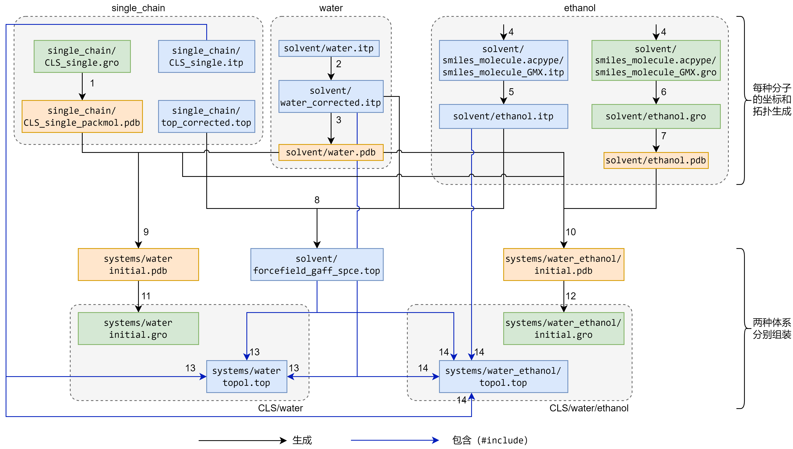
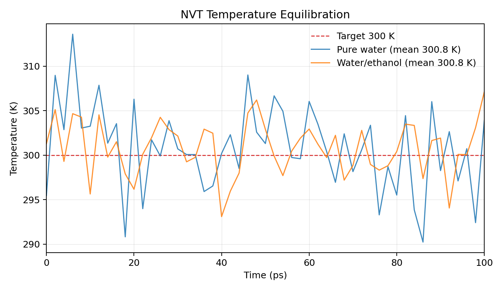
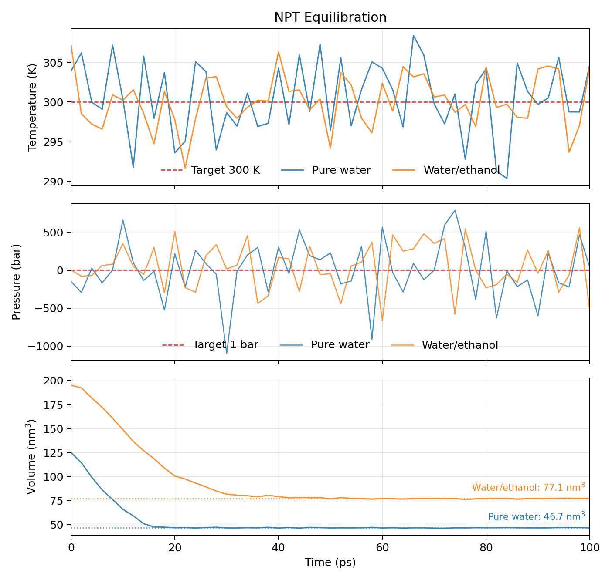
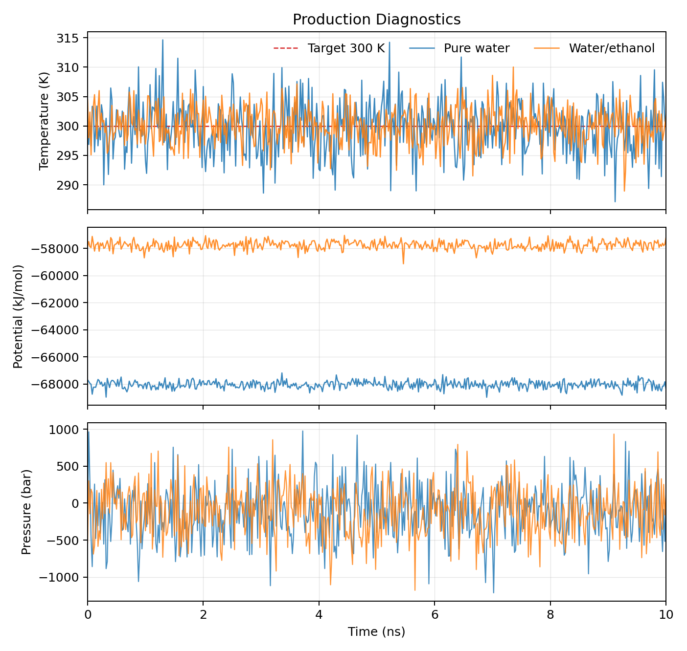
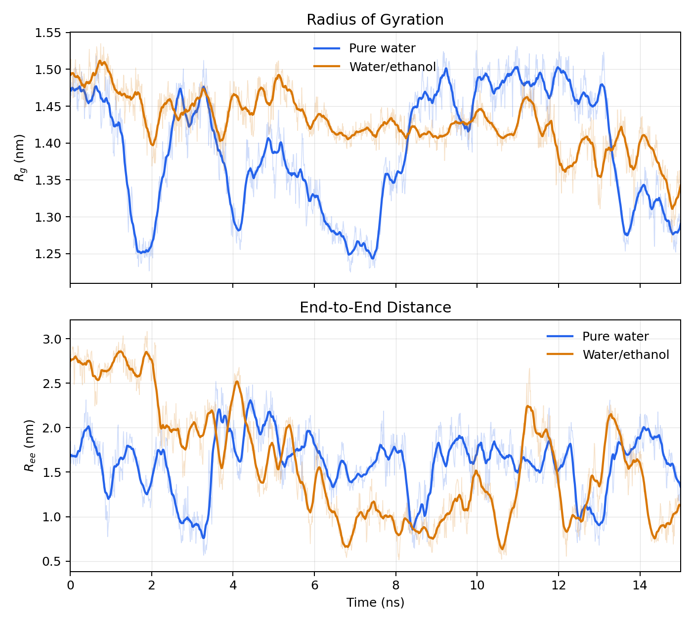

# 1. 体系拆分

## 1.1 原始 `gro` 的理解

原始`gro`为给定坐标文件 `polymer/CLS_10chains.gro`。该文件每行信息如下：

- 第1行是标题行

- 第2行给出的总原子数为2120

- 第3行至第2122行（倒数第二行）是原子行。根据GROMACS[官方说明](https://manual.gromacs.org/archive/5.0.3/online/gro.html#:~:text=Files%20with%20the%20gro%20file%20extension%20contain%20a,be%20used%20as%20trajectory%20by%20simply%20concatenating%20files.)，依次为
	- residue number (5 positions, integer)
	- residue name (5 characters)
	- atom name (5 characters)
	-  (5 positions, integer)
	- position (in nm, x y z in 3 columns, each 8 positions with 3 decimal places)
	
	例如对于` 100CLSB  H102 2120  6.902  2.435  3.942`这行，残基编号是`100`，残基名称是`CLSB`，原子名称是`H102`，原子编号是`2120`，空间坐标是`(6.902 nm, 2.435 nm, 3.942 nm)`。
	
- 第2123行（最后一行）是模拟盒子的尺寸，单位是nm。在这里，盒子尺寸是12 nm x 12 nm x 12 nm。

观察residue列可知：体系包含 residue 1-100。也就是有100个残基，要么是CLSA，要么是CLSB。体系有三种原子：C、H、O。

观察atom name列可知，从第3行开始，每212行为一个循环。例如，在第215行之前，氢原子从`H1`逐渐变化到`H102`，但在第215行又变回了`H1`。脚本`scripts/check_atom_name_cycles.py`的输出为

```
Atom-name cycle check: PASS
Input file: F:\polymer_task\polymer\CLS_10chains.gro
Total atoms: 2120
Atoms per cycle: 212
Cycle count: 10
Atom-name sequence is identical in every 212-atom cycle.
Atom names are unique within each 212-atom cycle.
First atom name in each cycle: H1
Last atom name in each cycle: H102
```

由此可以证实：`polymer/CLS_10chains.gro`的 atom name序列每212个原子就会有一次完全重复，且每个212原子块内部的atom name唯一。

结合可视化软件，可进一步证实这一点：


由此推断，该体系由10条相同聚合物链组成。每条链包含 10 个 residue、212 个原子，总计为：

```text
10 chains x 10 residues/chain = 100 residues
10 chains x 212 atoms/chain   = 2120 atoms
```

链与原子编号的对应关系如下：

```text
chain 1: residue 1-10,   atom 1-212
chain 2: residue 11-20,  atom 213-424
chain 3: residue 21-30,  atom 425-636
...
chain 10: residue 91-100, atom 1909-2120
```

本报告选择第一条链，即residue 1-10、atom 1-212。选择第一条链的原因是其原子编号已经从1开始，生成单链坐标时不需要额外重编号，后续也更容易与单链拓扑对应。

## 1.2 单链拆分过程

拆分过程使用 Python 脚本 `scripts/extract_first_chain_gro.py` 完成。脚本中的通用 `.gro` 读写函数放在 `scripts/utils/gmx_io.py` 中，包括：

- `read_gro()`：读取标题行、原子数、原子坐标行和盒子尺寸行；
- `write_gro()`：根据标题、原子坐标行和盒子尺寸行写出新的 `.gro` 文件；
- `parse_gro_atom_line()`：按照 `.gro` 固定列宽格式解析 residue 编号、residue 名、原子名和原子编号。

具体处理逻辑为：

1. 读取 `polymer/CLS_10chains.gro`；
2. 检查原始文件原子数不少于 212；
3. 取原始坐标文件中前 212 条原子坐标行，即 atom 1-212；
4. 保留原始盒子尺寸行；
5. 将标题行改为单链说明，并将原子数写为 212；
6. 输出单链坐标文件 `single_chain/CLS_single.gro`。

生成的单链坐标文件为`single_chain/CLS_single.gro`。

该文件包含 212 个原子，对应原始体系中的第一条聚合物链。

## 1.3 结果检查方式

为了确认拆出的单链结果是自洽的，本工作同时采用脚本检查和可视化检查。

脚本检查由 `scripts/extract_first_chain.py` 在写出 `CLS_single.gro` 后自动执行，检查内容包括：

- `CLS_single.gro` 第 2 行原子数为 212；
- 实际原子坐标行数为 212；
- 单链原子编号从 1 连续到 212；
- residue 范围为 1-10；
- 原始文件中的下一条链从 residue 11、atom 213 开始；
- 拆出的 212 条原子坐标与原始 `CLS_10chains.gro` 中 atom 1-212 完全一致；
- 单链文件保留了原始 `gro` 文件的盒子尺寸行。

脚本输出如下：

```text
Single-chain .gro self-consistency check: PASS
Original atoms: 2120
Single-chain atoms: 212
Single-chain atom range: 1-212
Single-chain residue range: 1-10
Next chain starts at residue 11 CLSA, atom 213 H1
Atom coordinates match original atoms 1-212 exactly.
Box line is preserved from the original .gro file.
```

此外，还进行了可视化检查。在原始 `CLS_10chains.gro` 中将 atom 1-212 高亮显示，可以看到这些原子在空间上构成一条完整且连续的聚合物链，而不是分散在多条链中。随后将提取出的 `CLS_single.gro` 单独可视化，其构象与原始体系中的高亮链一致。


因此，结合编号检查、坐标逐行一致性检查和可视化结果，可以确认 `single_chain/CLS_single.gro` 是从原始多链体系中正确拆出的第一条聚合物单链坐标文件。
# 2. 拓扑修正与组织

## 2.1 单链 ITP 的生成

原始拓扑文件为 `topology/CLS_10chains.itp`，对应 10 条聚合物链，`[ moleculetype ]` 名称为 `CLS10`，并包含 2120 个原子及完整 10 链体系的 bonded interactions。任务一得到的 `single_chain/CLS_single.gro` 只包含第一条链的 212 个原子，因此不能直接使用原始 10 链拓扑。

单链拓扑由脚本 `scripts/task2/extract_first_chain_itp.py` 生成。处理逻辑如下：

1. 使用 ParmEd 读取 `topology/CLS_10chains.itp`；
2. 截取前 212 个原子，对应第一条链；
3. 保留只属于这 212 个原子的 bonds、pairs、angles 和 dihedrals；
4. 将输出的 moleculetype 命名为 `CLS`；
5. 写出单链拓扑 `single_chain/CLS_single_raw.itp`；
6. 检查单链itp文件与单链gro文件的一致性。

为了确认 `topology/CLS_10chains.itp` 的前 212 个 `[ atoms ]` 条目确实与 `single_chain/CLS_single.gro` 中的 212 个原子对应，脚本在写出单链 ITP 后进行了逐项检查。检查复用 `scripts/utils/gmx_io.py` 中的 ParmEd 读入接口，分别读取 `single_chain/CLS_single.gro` 和 `topology/CLS_10chains.itp`，并比较前 212 个原子的顺序编号、residue 顺序编号、residue name 和 atom name。

检查输出为：

```text
GRO/ITP atom correspondence check: PASS
Checked atoms: 212
First atom: 1 1 CLSA H1
Last atom: 212 10 CLSB H102
```

这说明 `single_chain/CLS_single.gro` 中的 atom 1-212 与 `topology/CLS_10chains.itp` 中 `[ atoms ]` 前 212 项在编号、残基和原子名称上完全一致，因此可以用原始 ITP 的前 212 个原子作为单链拓扑的来源。

生成的单链拓扑中，`[ moleculetype ]` 为：

```ini
[ moleculetype ]
; Name            nrexcl
CLS             3
```

这要求主拓扑中的 `[ molecules ]` 段也使用同名分子 `CLS`。

## 2.2 主拓扑文件组织

为了测试单链拓扑能否被 GROMACS 正确读取，先编写最小主拓扑文件 `single_chain/topol_raw.top`，包含刚生成的 `CLS_single_raw.itp`：

```ini
[ defaults ]
# 这里省略了，直接从topology/CLS_10chains.itp拷贝即可
[ atomtypes ]
# 这里省略了，直接从topology/CLS_10chains.itp拷贝即可

#include "CLS_single_raw.itp"

[ system ]
CLS single chain

[ molecules ]
CLS 1
```

其中 `[ defaults ]` 和 `[ atomtypes ]` 可以从原始 `topology/CLS_10chains.itp` 中注释段落直接拷贝。

`[ system ]` 和 `[ molecules ]` 较简单，可以手写。其中 `[ molecules ]` 写作`CLS 1`，表示当前坐标文件中有 1 个 `CLS` 分子。这与 `single_chain/CLS_single.gro` 中只包含一条聚合物链相对应，也与单链 ITP 中的 moleculetype 名称一致。

## 2.3 grompp 验证

使用单链拓扑尝试生成 `.tpr`，测试单链坐标、单链拓扑和主拓扑是否能被 GROMACS 读取：

```bash
gmx_mpi grompp \
  -f mdp/em.mdp \
  -c single_chain/CLS_single.gro \
  -p single_chain/topol_raw.top \
  -o single_chain/em_raw.tpr
```

在GROMACS 2022.2环境下，弹出警告

```
WARNING 1 [file mdp/em.mdp, line 33]:
  Unknown left-hand 'controller' in parameter file
```

回看`em.mdp`，确实有一个字段`controller = horizon`。弹出这个警告，说明GROMACS无法识别这个字段。注释掉这个字段，再次运行，该命令成功生成 `.tpr`。关键输出包括：

```text
Generated 28 of the 28 non-bonded parameter combinations
Generating 1-4 interactions: fudge = 0.5

Generated 28 of the 28 1-4 parameter combinations

Excluding 3 bonded neighbours molecule type 'CLS'

turning H bonds into constraints...
Analysing residue names:
There are:    10      Other residues
Analysing residues not classified as Protein/DNA/RNA/Water and splitting into groups...
Number of degrees of freedom in T-Coupling group rest is 530.00

The largest distance between excluded atoms is 0.399 nm
Calculating fourier grid dimensions for X Y Z
Using a fourier grid of 100x100x100, spacing 0.120 0.120 0.120

Estimate for the relative computational load of the PME mesh part: 1.00

NOTE 1 [file mdp/em.mdp]:
  The optimal PME mesh load for parallel simulations is below 0.5
  and for highly parallel simulations between 0.25 and 0.33,
  for higher performance, increase the cut-off and the PME grid spacing.
```

这说明 `atomtypes`、`defaults`、moleculetype 名称、原子数以及 bonded interactions 在 GROMACS 预处理层面可以被正确读取。输出中的 PME mesh load 是性能提示，不是拓扑错误。

## 2.4 可视化与价态检查

虽然 `grompp` 可以生成 `.tpr`，但这只能说明拓扑在 GROMACS 语法和参数层面可被解释，并不保证化学键连接完全合理。因此进一步将单链体系导出为带键连信息的 PDB：

```bash
python scripts/task2/export_single_chain_pdb.py
```

该脚本使用 ParmEd 从主拓扑和 `single_chain/CLS_single.gro` 读取拓扑与坐标，并写出带 `CONECT` 记录的 PDB，便于在可视化软件中查看拓扑定义的键连关系。


可视化后发现，`H1` 与 `H4` 两个氢原子之间存在一条异常的 H-H 键，使两个氢原子都变成二配位。

为了进一步检查是否有其他类似多余或缺少的键，我编写了一个价态检查脚本，它检查所有原子：

- 如果是氢原子，有且只能连一根键
- 如果是碳原子，所连的键数应该至少为2，至多为4
- 如果是氧原子，所连的键数应该至少为1，至多为2

运行这个脚本

```bash
python scripts/task2/check_valence_rules.py
```

输出：

```text
Input: F:\polymer_task\single_chain\CLS_single_raw.itp
Atoms: 212
Bonds: 222
Violations: 2
   1   H1 H has 2 bonds -> 2:C1, 9:H4
   9   H4 H has 2 bonds -> 1:H1, 5:C4
```

这说明体系中只有一根多余的键，也即之前提到的`H1`和`H4`之间的键。

对应的错误条目位于 `single_chain/CLS_single_raw.itp` 的 `[ bonds ]` 段：

```ini
[ bonds ]
;    ai     aj funct         c0         c1
      1      9     1   0.10900 314550.000000
```

追溯到原始 `topology/CLS_10chains.itp`，同样可以看到：

```ini
1     9   1   0.1090e+00   3.1455e+05 ;     H1 - H4
```

因此，该错误来自原始聚合物 ITP，而不是单链提取或 PDB 导出过程引入的。

值得注意的是，该 H-H 键在化学上不合理，但在 GROMACS 语法上是合法的 bonded interaction。这是因为`grompp` 只能检查拓扑语法、原子编号、参数完整性以及坐标/拓扑数量是否匹配，但不能保证拓扑的化学结构一定正确。因此该问题需要结合可视化和价态规则检查才能定位。

## 2.6 修正itp

删除`single_chain\CLS_single_raw.itp` 中  `[ bonds ]` 部分错误的 H-H 键：

```ini
      1      9     1   0.10900 314550.000000
```

结果保存为`single_chain\CLS_single_corrected.itp`。对修正结果进行价态检查，输出

```text
Input: F:\polymer_task\single_chain\CLS_single_corrected.itp
Atoms: 212
Bonds: 221
Violations: 0
```

对修正后的PDB进行可视化（图3右侧），可以看到异常的H - H键已被去除。

## 2.7 分子结构确认

根据原子类型与键连关系，可以确认聚合物的分子结构如下：


单体是葡萄糖。相邻葡萄糖环在空间上交替翻转。[CLSA-CLSB]作为一个重复单元（纤维二糖），重复5次，形成DP = 10的纤维素寡聚物。

## 生成正确的TPR

编写 `single_chain/topol_corrected.top`，其结构与 `topol_raw.top` 相同，只是将 `#include` 的文件改为修正后的 ITP：

```text
#include "CLS_single_corrected.itp"
```

使用 corrected 主拓扑再次生成 `.tpr`：

```bash
gmx_mpi grompp \
  -f mdp/em.mdp \
  -c single_chain/CLS_single.gro \
  -p single_chain/topol_corrected.top \
  -o single_chain/em_corrected.tpr
```

该命令可正常完成，说明删除异常 H-H bond 后，拓扑仍能被 GROMACS 正确预处理。

# 3. 模拟流程

## 3.1 拓扑生成与体系构建

任务三构建模拟体系的整体流程如下：



上面的流程图展示了14个步骤，对应14个新的文件，分别如下：

| 序号 | 生成的文件                                    | 功能                                                         | 数据来源                                                     | 生成方法                                                     |
| ---- | --------------------------------------------- | ------------------------------------------------------------ | ------------------------------------------------------------ | ------------------------------------------------------------ |
| 1    | single_chain/<br />CLS_single_packmol.pdb     | 作为 PackMol 放置单条聚合物链的结构模板。                    | single_chain/CLS_single.gro                                  | 由 `write_origin_centered_cls_pdb` 生成；读取单链坐标，把几何中心平移到原点附近；把 residue name 统一为 `CLS`；导出 PackMol 用 PDB。 |
| 2    | solvent/<br />water_corrected.itp             | 定义水分子 `SOL` 的 GROMACS 拓扑，供两套溶剂体系 include。   | solvent/water.itp                                            | 基于`solvent/water.itp`，保留`[ moleculetype ]`, `[ atoms ]`, `[ settles ]`，删除其余部分。新增`[ exclusions ]`。**注1**。 |
| 3    | solvent/<br />water.pdb                       | 作为 PackMol 放置水分子的结构模板。                          | `solvent/water.itp` 中 `[ settles ]` 的 `doh = 0.1000 nm` 和 `dhh = 0.1630 nm` | 由 `scripts/task3/prepare_task3_input.py` 中的 `write_water_pdb_template` 计算生成；将 SETTLE 几何从 nm 换算到 Angstrom。**注2**。 |
| 4    | solvent/<br />smiles_molecule.actype          | 乙醇分子原始拓扑和坐标。                                     | ACPYPE                                                       | `acpype -i CCO -o gmx`                                       |
| 5    | solvent/<br />ethanol.itp                     | 定义乙醇 `ETH` 分子的 GROMACS 拓扑，供水-乙醇溶剂体系 include | ACPYPE 输出 solvent/<br />smiles_molecule.acpype/<br />smiles_molecule_GMX.itp | 由 `write_clean_ethanol_itp` 生成；从 `[ moleculetype ]` 开始保留，略去 ACPYPE 原文件中的 `[ atomtypes ]`；把 molecule name 从 `smiles_molecule` 改为 `ETH`；把 residue name 从 `UNL` 改为 `ETH`。 |
| 6    | solvent/<br />ethanol.gro                     | 保存单个乙醇分子的整理后坐标，便于检查和作为 PDB 导出的中间坐标。 | ACPYPE 输出 solvent/<br />smiles_molecule.acpype/<br />smiles_molecule_GMX.gro | 由 `scripts/task3/prepare_task3_input.py` 中的`write_clean_ethanol_coordinates`生成；用 ParmEd 读取乙醇坐标；把 residue name 改为 `ETH`；保留原 GRO 盒子尺寸。 |
| 7    | solvent/<br />ethanol.pdb                     | 作为 PackMol 放置乙醇分子的结构模板。                        | `solvent/ethanol.gro`                                        | 由 `scripts/task3/prepare_task3_input.py` 中的 `write_clean_ethanol_coordinates` 通过 `pdb_io.export_pdb` 导出。 |
| 8    | solvent/<br />forcefield_gaff_spce.itp        | 提供全体系共享的 `[ defaults ]` 和 atomtypes，避免分子 ITP include 时出现 directive 顺序错误。 | single_chain/<br />topol_corrected.top、solvent/<br />smiles_molecule.acpype/<br />smiles_molecule_GMX.itp、solvent/water.itp | 由 `scripts/task3/prepare_task3_input.py` 中的  `write_forcefield_file` 自动解析生成；读取 `topol_corrected.top` 的 `[ defaults ]`，合并三个来源中的 `[ atomtypes ]`，按 atomtype 名称去重，并检查重复 atomtype 的参数是否一致。 |
| 9    | systems/<br />water/initial.pdb               | PackMol 输出的纯水体系初始结构，供可视化检查和后续 GRO 转换。 | single_chain/<br />CLS_single_packmol.pdb、solvent/water.pdb | `packmol < systems/water/packmol.inp`。**注3**。             |
| 10   | systems/<br />water_ethanol/<br />initial.pdb | PackMol 输出的水/乙醇体系初始结构，供可视化检查和后续 GRO 转换。 | single_chain/<br />CLS_single_packmol.pdb、solvent/water.pdb、solvent/ethanol.pdb | `packmol < systems/water_ethanol/packmol.inp`。**注3**。     |
| 11   | systems/<br />water/initial.gro               | GROMACS纯水体系初始坐标文件，供 `grompp` 生成后续 EM 输入。  | systems/water/initial.pdb                                    | 由 `scripts\task3\packmol_pdb_to_gro.py` 生成。此脚本做三件事：确保所有原子都在盒子内；将残基名替换为原始gro文件的残基名（如CLSA, CLSB等）；将盒子尺寸替换为指定尺寸。 |
| 12   | systems/<br />water_ethanol/initial.gro       | GROMACS水/乙醇体系初始坐标文件，供 `grompp` 生成后续 EM 输入。 | systems/<br />water_ethanol/initial.pdb                      | 由 `scripts\task3\packmol_pdb_to_gro.py` 生成。此脚本做三件事：确保所有原子都在盒子内；将残基名替换为原始gro文件的残基名（如CLSA, CLSB等）；将盒子尺寸替换为指定尺寸。 |
| 13   | systems/<br />water/topol.top                 | 纯水体系主拓扑，供 `grompp` 生成 EM/NVT/NPT/production 的TPR。 | solvent/<br />forcefield_gaff_spce.itp、single_chain/CLS_single.itp、solvent/water_corrected.itp | 先 include 力场头文件，再 include 分子 ITP；`[ molecules ]` 写 `CLS 1` 和 `SOL 1500`。**注4**。 |
| 14   | systems/<br />water_ethanol/topol.top         | 水/乙醇体系主拓扑，供 `grompp` 生成 EM/NVT/NPT/production 的TPR。 | solvent/<br />forcefield_gaff_spce.itp、single_chain/CLS_single.itp、solvent/water_corrected.itp、solvent/ethanol.itp | 先 include 力场头文件，再 include 分子 ITP；`[ molecules ]` 写 `CLS 1`、`SOL 1050`、`ETH 450`。**注5**。 |

**注1**：原有`solvent/water.itp`不可用。不仅仅是因为原有拓扑的`[ atomtypes ]`需要合并到力场top中（以免include顺序错误），还因为

1. 水分子已经用`[ settles ]`约束了，无需再用 `[ angles ]`约束。

2. `[ virtualsite3 ]`不是GROMACS可识别的指令。即使改成GROMACS可识别的`[ virtual_sites3]`，也依旧不对，因为这里使用的是SPC/E三点水模型，无需虚拟点。若改为`[ virtual_sites3]`，则会产生以下报错。

   ```bash
   cd systems/water
   gmx_mpi grompp -f ../../mdp/em.mdp -c initial.gro -p topol_water_virtual_sites3_test.top -o em_water_virtual_sites3_test.tpr
   ```

   输出：

   ```
   Cleaning up constraints and constant bonded interactions with virtual sites
   
   ERROR: Cannot have constraint (1-2) with virtual site (1)
   ```

3. 需要添加 `[ exclusions ]` ，以排除水分子内部非键作用。

**注2**：假定水分子在$z=0$的平面上，氧原子在原点。氢氧间距为$\overline{OH}$，氢氢间距为$\overline{HH}$。再假定第一个氢原子在$(\overline{OH},0)$的位置。那么第二个氢原子的坐标$(x,y)$满足
$$
\begin{cases}
x^2+y^2=\overline{OH}^2\\
(x-\overline{OH})^2+y^2=\overline{HH}^2
\end{cases}
$$
于是（y取大于零的根）
$$
\begin{cases}
x=(2\overline{OH}^2-\overline{HH}^2)/2\overline{OH}\\
y=\sqrt{\overline{OH}^2-x^2}
\end{cases}
$$
**注3**：PackMol 输入中的盒子尺寸目前按保守初始构型设置：纯水体系使用约 50 Å = 5.0 nm 的立方盒子，聚合物放在三个方向上3-47 Å的区域里，水分子放在三个方向上1.5-48.5 Å的区域里。这样做一方面是为了确保没有分子超出盒子，另一方面是为了确保聚合物完全被水包裹。水/乙醇体系使用约 58 Å = 5.8 nm 的立方盒子，而没有沿用 5.0 nm，主要是因为乙醇分子明显大于水分子；虽然两套体系溶剂分子数同为 1500 个量级，但混合体系总原子数更多，初始放置时更容易拥挤，因此给更大的初始盒子（毕竟这不是最终的盒子尺寸，后面还要做NPT平衡）。

**注4**：`systems\water\topol.top`：

```ini
; Topology for CLS single chain in water.
#include "../../solvent/forcefield_gaff_spce.itp"

#include "../../single_chain/CLS_single.itp"
#include "../../solvent/water_corrected.itp"

[ system ]
CLS single chain in water

[ molecules ]
; Compound        #mols
CLS             1
SOL             1500
```

**注5**：`systems\water_ethanol\topol.top`：

```ini
; Topology for CLS single chain in water/ethanol mixed solvent.
#include "../../solvent/forcefield_gaff_spce.itp"

#include "../../single_chain/CLS_single.itp"
#include "../../solvent/water_corrected.itp"
#include "../../solvent/ethanol.itp"

[ system ]
CLS single chain in water/ethanol mixed solvent

[ molecules ]
; Compound        #mols
CLS             1
SOL             1050
ETH             450
```

坐标文件与拓扑分子数的对应关系如下。单条聚合物链有 212 个原子，水分子有 3 个原子，乙醇分子有 9 个原子。因此：

- 纯水体系：212 + 1500 × 3 = 4712 个原子，与 `systems/water/initial.gro`中的 4712 个原子一致。
- 水/乙醇体系：212 + 1050 × 3 + 450 × 9 = 7412 个原子，与 `systems/water_ethanol/initial.gro` 中的 7412 个原子一致。

这种组织方式适合多分子体系，因为力场公共参数只定义一次，各分子拓扑彼此独立，主 top 只负责选择需要包含的分子类型并在 `[ molecules ]` 中给出数量。这样同一套 CLS、SOL、ETH 分子拓扑可以复用于不同溶剂组成的体系，后续调整水/乙醇比例时只需要修改主拓扑和 PackMol 输入中的分子数。

## 3.2 动力学流程

两套体系都采用同一套 GROMACS 流程：EM → NVT → NPT → 生产。纯水体系目录为 `systems/water`，水/乙醇体系目录为 `systems/water_ethanol`。每一步都先由 `grompp` 把坐标、拓扑和 `.mdp` 参数编译为 `.tpr`，再由 `mdrun` 读取 `.tpr` 执行计算。

任务三使用的动力学参数文件包括 `mdp/em.mdp`、`mdp/task3_nvt.mdp`、`mdp/task3_npt.mdp` 和 `mdp/task3_prod.mdp`。其中 `em.mdp` 直接用于能量最小化；后三个文件由 `scripts/task3/prepare_task3_inputs.py` 中的 `write_task3_mdp_files` 从原始模板 `mdp/nvt.mdp`、`mdp/npt.mdp` 和 `mdp/nvt_prod.mdp` 生成。生成时保留原始模板中的步长、步数、非键相互作用、约束和输出频率等主体设置，同时针对本任务做了温度耦合组和连续模拟设置的修改。

### 3.2.1 能量最小化（EM）

EM 阶段的主要目的是消除 PackMol 初始构型中可能存在的局部高能接触。PackMol 负责把聚合物和溶剂分子放进盒子并避免严重重叠，但它不按照力场势能优化结构，因此正式动力学前需要先做能量最小化。

本阶段直接使用 `mdp/em.mdp`，主要参数为：

```ini
integrator = steep
nsteps     = 5000
emtol      = 1000.0
emstep     = 0.01
tcoupl     = no
pcoupl     = no
```

也就是说，使用 steepest descent 算法最多最小化 5000 步，当最大力小于 1000 kJ mol^-1 nm^-1 时认为达到停止条件。EM 不是动力学采样，所以不进行温度和压力耦合。非键相互作用使用 Verlet cutoff scheme 和 PME 静电处理，`rcoulomb` 与 `rvdw` 均为 1.2 nm。

本阶段的输入和输出如下：

| 体系 | 输入文件 | 输出文件 |
| --- | --- | --- |
| 纯水 | `systems/water/initial.gro`、`systems/water/topol.top`、`mdp/em.mdp` | `systems/water/em.tpr`、`em.gro`、`em.edr`、`em.trr`、`em.log` |
| 水/乙醇 | `systems/water_ethanol/initial.gro`、`systems/water_ethanol/topol.top`、`mdp/em.mdp` | `systems/water_ethanol/em.tpr`、`em.gro`、`em.edr`、`em.trr`、`em.log` |

运行命令如下，两套体系只需要替换工作目录：

```bash
cd systems/water
gmx_mpi grompp -f ../../mdp/em.mdp -c initial.gro -p topol.top -o em.tpr
gmx_mpi mdrun -deffnm em

cd ../water_ethanol
gmx_mpi grompp -f ../../mdp/em.mdp -c initial.gro -p topol.top -o em.tpr
gmx_mpi mdrun -deffnm em
```

对于两套体系

1. `grompp` 均能成功生成 `.tpr`，说明坐标文件中的原子数、分子数和拓扑文件基本匹配；
2. `mdrun` 正常结束并写出 `em.gro`；
3. `em.log` 中最大力均降到 `emtol` 以下，势能明显下降且没有出现 LINCS、非数值能量等错误。具体如下：

| 体系 | EM 结果 |
| --- | --- |
| 纯水 | 65 步收敛，`Potential Energy = -2.3455436e+04` kJ/mol，`Maximum force = 9.9634589e+02` kJ mol^-1 nm^-1 |
| 水/乙醇 | 54 步收敛，`Potential Energy = -1.6361562e+04` kJ/mol，`Maximum force = 7.6383295e+02` kJ mol^-1 nm^-1 |

这说明EM阶段两个体系基本正常。

### 3.2.2 NVT

NVT 阶段的主要目的是在固定体积下把体系温度平衡到 300 K。此阶段从 EM 后的结构开始，生成初速度，然后使用 V-rescale thermostat 进行温度耦合。

原始 `mdp/nvt.mdp` 的温度耦合组为：

```ini
tc-grps = SPEEK  SOL
tau_t   = 0.1    0.1
ref_t   = 300    300
```

这个设置不能直接用于任务三，因为本任务聚合物的分子名为 `CLS`，混合溶剂中还包含乙醇 `ETH`。如果继续使用 `SPEEK SOL`，不同体系需要额外准备不同 index group，也容易导致部分原子没有被分配到温度耦合组。因此 `write_task3_mdp_files` 将温度耦合组统一改为：

```ini
tcoupl  = V-rescale
tc-grps = System
tau_t   = 0.1
ref_t   = 300
```

NVT 是第一个真正的 MD 阶段，输入来自 EM，没有上一阶段的速度需要延续，所以在 `task3_nvt.mdp` 末尾加入：

```ini
gen_vel  = yes
gen_temp = 300
gen_seed = -1
```

步长和模拟长度保留原始模板设置：

```ini
dt     = 0.002
nsteps = 50000
pcoupl = no
```

因此 NVT 平衡时间为 100 ps，并且不做压力耦合。

本阶段的输入和输出如下：

| 体系 | 输入文件 | 输出文件 |
| --- | --- | --- |
| 纯水 | `systems/water/em.gro`、`systems/water/topol.top`、`mdp/task3_nvt.mdp` | `systems/water/NVT/nvt.tpr`、`nvt.gro`、`nvt.cpt`、`nvt.edr`、`nvt.log` |
| 水/乙醇 | `systems/water_ethanol/em.gro`、`systems/water_ethanol/topol.top`、`mdp/task3_nvt.mdp` | `systems/water_ethanol/NVT/nvt.tpr`、`nvt.gro`、`nvt.cpt`、`nvt.edr`、`nvt.log` |

运行命令如下：

```bash
cd systems/water/NVT
gmx_mpi grompp -f ../../../mdp/task3_nvt.mdp -c ../em.gro -p ../topol.top -o nvt.tpr
mpirun -np 16 gmx_mpi mdrun -deffnm nvt

cd ../../water_ethanol/NVT
gmx_mpi grompp -f ../../../mdp/task3_nvt.mdp -c ../em.gro -p ../topol.top -o nvt.tpr
mpirun -np 16 gmx_mpi mdrun -deffnm nvt
```

对于两套体系

1. `grompp` 均可以生成 `nvt.tpr`；
2. `mdrun` 正常跑完 50000 步并写出 `nvt.gro` 与 `nvt.cpt`；
3. 温度在短暂调整后围绕 300 K 波动；
4. 日志中没有 LINCS warning、爆温、坐标非数值等错误。



这说明NVT阶段两个体系基本正常。

### 3.2.3 NPT

NPT 阶段的主要目的是在 300 K、1 bar 条件下让盒子体积和密度进行压力平衡。PackMol 使用的是为了容易装箱而设置的保守初始盒子，并不保证密度合理，因此 NPT 是把体系从初始装箱体积调整到更合理体积的重要步骤。

`task3_npt.mdp` 也是由原始 `mdp/npt.mdp` 生成。与 NVT 一样，温度耦合组从 `SPEEK SOL` 改为 `System`。不同之处在于，NPT 从 NVT 的 checkpoint 接续，不能重新生成速度，因此加入：

```ini
continuation = yes
gen_vel      = no
```

压力耦合部分保留原始模板设置：

```ini
pcoupl           = Parrinello-Rahman
pcoupltype       = isotropic
tau_p            = 2.0
ref_p            = 1.0
compressibility  = 4.5e-5
refcoord_scaling = com
```

这里 `ref_p = 1.0` 表示目标压力为 1 bar，`pcoupltype = isotropic` 表示盒子三个方向等比例缩放。NPT 的步长仍为 2 fs，`nsteps = 50000`，对应 100 ps。

本阶段的输入和输出如下：

| 体系 | 输入文件 | 输出文件 |
| --- | --- | --- |
| 纯水 | `systems/water/NVT/nvt.gro`、`systems/water/NVT/nvt.cpt`、`systems/water/topol.top`、`mdp/task3_npt.mdp` | `systems/water/NPT/npt.tpr`、`npt.gro`、`npt.cpt`、`npt.edr`、`npt.log` |
| 水/乙醇 | `systems/water_ethanol/NVT/nvt.gro`、`systems/water_ethanol/NVT/nvt.cpt`、`systems/water_ethanol/topol.top`、`mdp/task3_npt.mdp` | `systems/water_ethanol/NPT/npt.tpr`、`npt.gro`、`npt.cpt`、`npt.edr`、`npt.log` |

运行命令如下：

```bash
cd systems/water/NPT
gmx_mpi grompp -f ../../../mdp/task3_npt.mdp -c ../NVT/nvt.gro -t ../NVT/nvt.cpt -p ../topol.top -o npt.tpr
mpirun -np 16 gmx_mpi mdrun -deffnm npt

cd ../../water_ethanol/NPT
gmx_mpi grompp -f ../../../mdp/task3_npt.mdp -c ../NVT/nvt.gro -t ../NVT/nvt.cpt -p ../topol.top -o npt.tpr
mpirun -np 16 gmx_mpi mdrun -deffnm npt
```

对于两个体系：

1. `grompp` 能从 NVT 的 `.gro` 和 `.cpt` 接续生成 `npt.tpr`；
2. `mdrun` 正常结束并写出新的 `npt.gro` 和 `npt.cpt`；
3. 温度仍在 300 K 附近（纯水体系平均300.6 K，水/乙醇体系平均300.1 K）；
4. 压力平均值与 1 bar 存在偏差，纯水约 2.7 bar，水/乙醇约 40.0 bar。但由于体系较小、NPT 时间仅 100 ps，压力瞬时涨落较大，短时间平均值不能作为严格收敛判据。这里主要依据体积是否趋于平台、温度是否稳定、体系是否无数值崩溃来判断 NPT 是否基本正常。后续若追求更充分平衡，应延长 NPT 时间，并重点比较后半段或最后一段时间的压力均值。
5. 盒子尺寸或体积逐步调整到相对稳定的范围（纯水体系约46.7 nm^3^，水/乙醇体系约77.3 nm^3^）。水/乙醇体系最终稳定体积明显大于纯水体系，主要来自乙醇分子比水分子具有更大的分子体积和更多原子数。虽然两套体系的溶剂分子总数都约为 1500，但混合体系中 450 个乙醇分子替代了部分水分子，使体系总排除体积增大，因此在 NPT 平衡后需要更大的盒子体积。该结果说明盒子体积调整方向是合理的，也从侧面支持初始混合溶剂体系没有被压缩到不合理的小体积。



这说明NPT阶段两个体系基本正常。

### 3.2.4 生产阶段

生产阶段的主要目的是在平衡后的结构上生成可用于后续构象分析的生产轨迹。本任务的 production 采用 NVT 条件，继续保持 300 K 温度耦合，不再做压力耦合。

`task3_prod.mdp` 由原始 `mdp/nvt_prod.mdp` 生成。与 NVT/NPT 一样，温度耦合组统一改为 `System`：

```ini
tcoupl  = V-rescale
tc-grps = System
ref_t   = 300
pcoupl  = no
```

生产阶段从 NPT 的 checkpoint 接续，因此不再生成新速度：

```ini
continuation = yes
gen_vel      = no
```

生产模拟步长为 2 fs，`nsteps = 5000000`，总时长为 10 ns：

```ini
dt     = 0.002
nsteps = 5000000
```

为了控制文件大小，普通坐标、速度和力输出关闭，只保存压缩轨迹：

```ini
nstxout = 0
nstvout = 0
nstfout = 0
nstxout-compressed = 5000
compressed-x-precision = 1000
```

由于 `dt = 0.002 ps`，`nstxout-compressed = 5000` 对应每 10 ps 保存一帧 `.xtc`；`nstlog = 10000` 和 `nstenergy = 10000` 对应每 20 ps 输出一次日志和能量。

本阶段的输入和输出如下：

| 体系 | 输入文件 | 输出文件 |
| --- | --- | --- |
| 纯水 | `systems/water/NPT/npt.gro`、`systems/water/NPT/npt.cpt`、`systems/water/topol.top`、`mdp/task3_prod.mdp` | `systems/water/PROD/prod.tpr`、`prod.xtc`、`prod.edr`、`prod.log` |
| 水/乙醇 | `systems/water_ethanol/NPT/npt.gro`、`systems/water_ethanol/NPT/npt.cpt`、`systems/water_ethanol/topol.top`、`mdp/task3_prod.mdp` | `systems/water_ethanol/PROD/prod.tpr`、`prod.xtc`、`prod.edr`、`prod.log`、`prod.gro` |

运行命令如下：

```bash
cd systems/water/PROD
gmx_mpi grompp -f ../../../mdp/task3_prod.mdp -c ../NPT/npt.gro -t ../NPT/npt.cpt -p ../topol.top -o prod.tpr
mpirun -np 16 gmx_mpi mdrun -deffnm prod

cd ../../water_ethanol/PROD
gmx_mpi grompp -f ../../../mdp/task3_prod.mdp -c ../NPT/npt.gro -t ../NPT/npt.cpt -p ../topol.top -o prod.tpr
mpirun -np 16 gmx_mpi mdrun -deffnm prod
```

对于两个体系：

1. `mdrun` 均完成500万步并正常写出 `prod.xtc`、`prod.edr` 和 `prod.log`；
2. 温度均值接近 300 K（纯水体系平均299.7 K，水/乙醇体系平均300.1 K）；
3. 能量没有持续漂移到非物理范围（纯水体系平均-68055.33 kJ/mol，水/乙醇体系平均-57757.90 kJ/mol）。水/乙醇体系的总势能比纯水体系更高（更正）。这主要来自体系组成差异：纯水体系含有更完整的水-水氢键和强静电相互作用网络，而混合溶剂中部分水被乙醇替代，乙醇的疏水乙基削弱了纯水氢键网络。不过这里更关注生产阶段各自势能是否随时间保持平稳。



这说明生产阶段两个体系基本正常。

# 4. 结果分析

## 4.1 分析方法

对每个体系使用以下命令进行回转半径（$R_g$）和末端距（$R_{ee}$）的分析

```bash
#!/usr/bin/env bash

# 任务四：纯水体系 production 轨迹分析命令。

cd systems/water/ANALYSIS
# cd systems/water_ethanol/ANALYSIS

TPR=prod.tpr
TPR=prod_15ns.tpr

# 为聚合物单链建立索引组。后续 gmx gyrate 会使用这个索引组，
# 从而只计算聚合物本身的回转半径，而不把溶剂包含进去。
gmx_mpi select -s ../PROD/${TPR} \
  -select '"CLS_SINGLE" atomnr 1 to 212' \
  -on cls.ndx

# 在几何分析前先处理周期性边界条件，使跨盒子的分子尽量保持完整。
# 这样可以减少聚合物被周期性边界切开而导致的分析误差。
printf "0\n" | gmx_mpi trjconv \
  -s ../PROD/${TPR} \
  -f ../PROD/prod.xtc \
  -o prod_whole.xtc \
  -pbc whole

# 计算聚合物单链的回转半径 Rg(t)。
# 输出文件：systems/water/PROD/rg.xvg
printf "CLS_SINGLE\n" | gmx_mpi gyrate \
  -s ../PROD/${TPR} \
  -f prod_whole.xtc \
  -n cls.ndx \
  -o rg.xvg

# 计算两个链端原子之间的末端距 Ree(t)。
# 这里主链一端的环碳（atom 2）到主链另一端的对应环碳（atom 195）作为链段
# 输出文件：systems/water/PROD/ree.xvg
gmx_mpi distance \
  -s ../PROD/${TPR} \
  -f prod_whole.xtc \
  -select '"Ree" atomnr 2 plus atomnr 195' \
  -oall ree.xvg
```

## 4.2 讨论

初始 10 ns 轨迹中 $R_g$ 和 $R_{ee}$ 仍有明显波动（见下图，绘图脚本为`scripts/task4/plot_rg_ree.py`），因此两个体系均进一步续算至 15 ns（以期得到更稳定的结果），使用如下命令：

```bash
gmx_mpi convert-tpr -s prod.tpr -extend 5000 -o prod_15ns.tpr
mpirun -np 16 gmx_mpi mdrun -deffnm prod -s prod_15ns.tpr -cpi prod.cpt -append
```

续算后重新分析得到的结果如下图所示。图中浅色曲线为原始时间序列，深色曲线为滑动平均，滑动窗口长度为21个时间步。



对 0-15 ns 的 XVG 数据进一步统计（脚本为`scripts/task4/plot_rg_ree.py`），结果如下表所示。这里的“前半程”为 0-7.5 ns，“后半程”为 7.5-15 ns。

| 体系 | 指标 | 全程均值 ± 标准差 / nm | 前半程均值 / nm | 后半程均值 / nm | 后半程 - 前半程 / nm |
| --- | --- | --- | --- | --- | --- |
| 纯水 | $R_g$ | 1.392 ± 0.083 | 1.362 | 1.421 | +0.058 |
| 纯水 | $R_{ee}$ | 1.597 ± 0.367 | 1.614 | 1.579 | -0.035 |
| 水/乙醇 | $R_g$ | 1.427 ± 0.040 | 1.450 | 1.405 | -0.045 |
| 水/乙醇 | $R_{ee}$ | 1.586 ± 0.654 | 1.927 | 1.245 | -0.682 |

从全程均值来看，水/乙醇体系的 $R_g$ 为 1.427 nm，仍然略大于纯水体系的 1.392 nm，这一点不符合“水/乙醇中链更收缩、$R_g$ 更小”的预期。$R_{ee}$ 的全程均值则分别为纯水 1.597 nm、水/乙醇 1.586 nm，两者非常接近，差异只有约 0.011 nm，远小于时间序列本身的波动幅度，因此不能据此给出强结论。

如果只看后半程，趋势会更接近预期：纯水体系的后半程 $R_g$ 为 1.421 nm，而水/乙醇体系为 1.405 nm，水/乙醇略小约 0.016 nm；纯水体系的后半程 $R_{ee}$ 为 1.579 nm，而水/乙醇体系为 1.245 nm，水/乙醇明显小约 0.334 nm。尤其是水/乙醇体系的 $R_{ee}$ 从前半程 1.927 nm 降到后半程 1.245 nm，下降 0.682 nm，说明该体系的链端距在模拟过程中经历了明显收缩。

不过，这个结果仍然不能视为充分平衡后的定量比较。原因是两个体系的 $R_g$ 和 $R_{ee}$ 在 15 ns 内仍有明显波动，且水/乙醇体系的 $R_{ee}$ 标准差达到 0.654 nm，说明链端距离对瞬时构象非常敏感。相比之下，$R_g$ 的波动较小，更能代表整条链的整体尺寸；$R_{ee}$ 只由两个端基环碳 atom 2 和 atom 195 定义，因此会受到链端局部运动和链折叠方式的强烈影响。

综上，当前数据可以支持的结论是：水/乙醇体系在 15 ns 内出现了明显的链端收缩过程，后半程的 $R_g$ 和 $R_{ee}$ 均低于纯水体系，趋势开始接近预期；但由于轨迹尚未表现出稳定平台，仍不宜把全程平均值解释为充分平衡后的溶剂效应。若要得到更可靠的定量结论，应继续延长 production，并优先比较最后一段稳定区间或采用 block average 评估误差。

